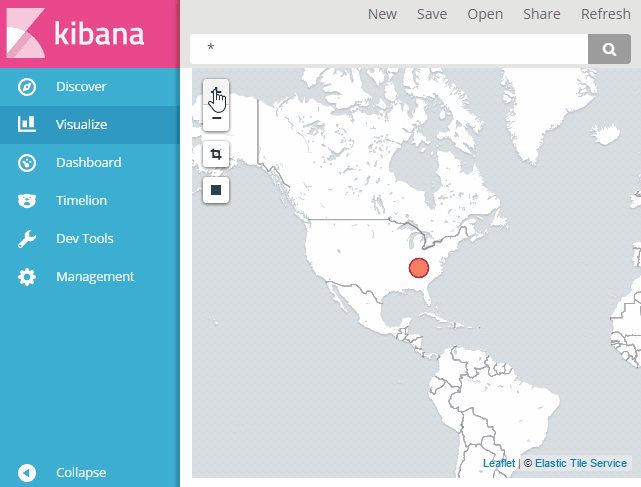

# vectortile-infra
Lab environment serving load-balanced vector tiles for use in kibana map visualizations.
Vagrant is the environment controller using VirtualBox.
Ansible is used for configuration management.

# Raster/Vector Map Comparison
## Official Kibana Raster Tile Map


## Vector Map Served by vectortile-infra


# Usage
```
vagrant up
vagrant ssh
./init.sh
```
then explore the map directly with the included index.html, at https://localhost:8080 or in Kibana at https://localhost:15601.

# Shout outs
Thanks to the many geo open source projects that made this possible: [OpenMapTiles](https://github.com/openmaptiles), [tileserver-gl](https://github.com/klokantech/tileserver-gl), [Mapbox GL JS](https://www.mapbox.com/mapbox-gl-js/api/), [Mapbox Vector Tiles](https://www.mapbox.com/vector-tiles/specification/), and [Maputnik](https://github.com/maputnik/editor)
